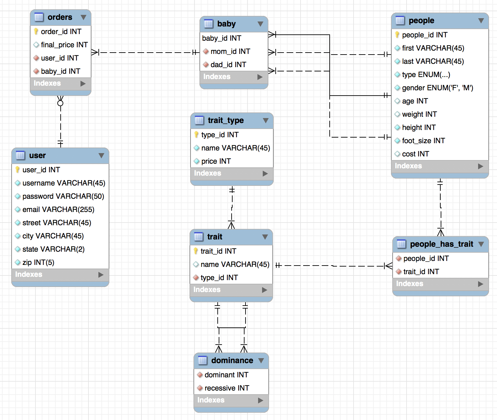

# Project Overview 
The goal of this project was to build what one might imagine an online designer baby store would look like. This store would consist of a web application supported by a database. The database would hold all the necessary information to allow users to fully customize any of their baby's traits they might want to change - for a cost! Users would be able to enter all the relevant genetic information of the parents they want to use for the child on the site. Alternatively they could choose from a pool of donors to use for either one of or both parents. 

The database would also support basic e-commerce functions such as keeping track of orders and profits. This information from our users is especially valuable as we can modify the pricing or certain traits depending on their popularity. 

Although this project was just an exercise to learn some new technologies, it is not entirely ridiculous to imagine such a website existing in the semi-near future. 

## Current Build
As the site stands right now a user can make an account and add parents to that account  by either entering all the information of the parent they want to use or by choosing from a list of donors. The site is connected to a functioning database so the accounts created and parents added will be stored correctly. Returning users can log in and updated the parents tied to their account as they like but that is about it.

The project is on a temporary hiatus at the moment but I do have plans to return to finish adding a homepage, baby creation functionality, and a way to complete orders.

## Frontend
This was my first time using almost all of tools that make up the site's frontend. With that in mind, I decided to use an iterative design process to learn as I go. I spent a good amount of time trying things out and making some basic pages and forms before I decided to actually jump into making the site. 

### Mockups
In the past I've found having well made mockups to be an essential part of the design process. Even though I've never been to one to make them, I felt as if this project was as good a time as any to start. I chose to use Adobe XD and I was very pleased with the program. It was easy to pick up, even for someone with little to no artistic skills, and the availability of premade templates online helped with inspiration when I found myself stuck.

### React and Redux
The original motivating factor for picking up this project was to learn React as I am planning on using it to rebuild an actual [e-commerce store](https://allmankindisstupid.com) that I created and am currently maintaining. It took a little to pick up at first but I genuinely came to enjoy working with React, and I am looking forward to gaining more experience with it in the future. I found that it abstracted a lot of the tiresome parts of web development, and the puzzle of how can I make my code as modular as possible was a fun added element. It's one of those tools that's great at making you feel clever when you use it correctly. 

The second half of this match made in heaven was one I didn't even know existed before I had already gotten a decently stuck into the project. I first heard about Redux and the fact that I needed to use it after approaching friend with my growing state management woes. He made it sound like the solution to all my problems, and although he wasn't exaggerating and I have come to greatly appreciate its usefulness, it was a real challenge to learn simultaneously with React. Conceptually it's not that bad, which I think is what makes it so attractive, but there's a lot of new syntax and best practices to learn all at once to make it work. I still don't feel as if I'm even close to using it to its full potential but I can say that I'm at least comfortable with the basics at this point, and I'm happy enough with that.

### Honorable Mentions
A small sub-goal I had in mind when starting this project was to familiarize myself with the css grid layout. I had used Foundation's xy grid heavily in my last project so I wanted to get comfortable with the actual layout. It far exceeded my expectations and I ended up relying on it heavily, admittedly more than I should have. On some pages it's grids all the way down. The more I learned about it the more impressed I was with its versatility and functionality. 

## Backend
The backend is overall less complex than the frontend but I had even less experience with this side of things so it ended up being more of a challenge. I recently overcame some issues that have made me think that I'll need to do a large refactoring at some point once I gain a better understanding of the underlying issues.

### Node and Express
I use Express to set up api endpoints that my frontend can make get and post requests to which allow it to interact with the database. This setup seemed fine until I started to encounter some strange bugs with the site. My Redux store would periodically reset itself and then immediately return to its original state with seemingly no provocation. This lead to subtle problems with the site that were confusing and hard to reproduce. I eventually figured out that making any kind of http request bothers Redux in the same way refreshing the page would. I solved this problem by avoiding it entirely and making all of my queries, which run asynchronously, now wait for each other so I can respond to the request after everything is finished. This lets me ensure that I don't do anything to my state while a request is in progress. This is obviously not ideal and not a permanent solution. I will figure out what I need to change before moving forward. I suspect it involves the use of some Redux middleware.

I ended up using Heroku to host my application because it seemed easy and straightforward to use. I haven't had any problems with it so I will probably continue to use it in the future.

### MySql Database
The database was designed to be simple since it only had to support the most basic functionality expected of an online store. You can see the ER diagram below.

This design presented some interesting challenges. To create an order you needed a user, three people, and a baby which was slightly awkward as I wanted to create an order as soon as a new user made an account. Another was the people_has_trait table which was necessary in order to be able to add a variable amount of disorders but was difficult to add and retrieve data from while keeping it updated with the associated entries in the people table. 

I used the mysql node.js module to query the database. It did everything I needed from it and had some nice features like taking care of sanitizing my queries for me. The only thing of note was how I ended up passing callbacks through all of my queries to ensure that they were completed in the right order and so that I would know when it was safe to respond to the client.